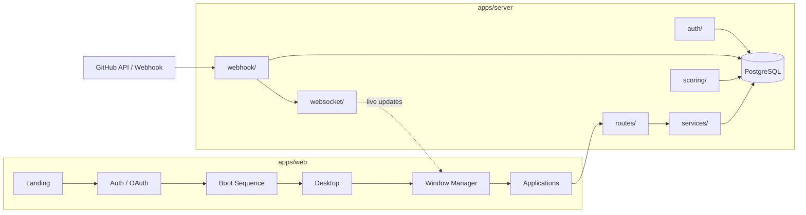

<div align="center">

#  ONYX-DevOS
### Engineering Workstation

**Retro look. Modern power. Zero noise.**

[](./LICENSE)
[](https://nodejs.org)
[](https://www.typescriptlang.org/)
[](#-contributing)
[](#-philosophy)

[Overview](#-overview) · [Features](#-features) · [Architecture](#-architecture) · [Getting Started](#-getting-started) · [Roadmap](#-roadmap) · [Contributing](#-contributing)

</div>

---

## 📖 Overview

**ONYX** bukan dashboard GitHub biasa. ONYX adalah **operating system** khusus buat engineering team — lengkap dengan boot screen, desktop, window manager, terminal, dan aplikasi modular (*Repository, Pull Requests, Reviews, Insights, Team, Reports, Heatmap*) yang semuanya jalan **real-time** lewat GitHub webhook.

<div align="center">
<sub><i>Tempatkan screenshot preview di <code>docs/preview.png</code> lalu ganti baris di bawah ini.</i></sub>

<!--  -->

</div>

### 🧭 Philosophy

> **Zero AI. Zero heavy compute. Just facts from your git data.**

Ga ada API key AI yang harus lo beli. Semua insight (*Bus Factor, Review Health, Commit Decay,* dst) dihitung dari data git lo sendiri secara **statistik** — bukan minta LLM buat "menganalisa". Clone, jalanin, gratis, selamanya.

---

## ✨ Features

| Kategori | Detail |
|---|---|
| 🖥️ **Desktop Experience** | Bukan halaman, tapi window — buka banyak aplikasi sekaligus, drag, resize, snap layout |
| ⚡ **Real-Time Sync** | Semua data terhubung live lewat GitHub webhook + WebSocket, ga perlu refresh |
| 📊 **Statistical Insights** | Bus Factor, Review Health, Commit Decay, Stale Radar, Reciprocity Gap, Weekend Heatmap |
| 🖱️ **Command Palette** | `Ctrl+K` buat power user — buka app, lompat ke PR, copy link, export, semua tanpa mouse |
| 🎨 **Theming** | 3 tema visual: CRT (retro), Modern, Pixel |
| 🔐 **GitHub OAuth Native** | Login & authorize repo langsung lewat GitHub, ga ada akun terpisah |

---

## 🏗 Architecture



**Alur produk:** `landing → auth → boot → desktop → window-manager → taskbar → applications`

Setiap event dari GitHub (push, PR, review, issue, check run) masuk lewat `webhook/`, diverifikasi signature-nya, disimpan ke `db/`, dihitung ulang skornya di `scoring/`, lalu di-broadcast real-time ke client yang sedang membuka repo itu lewat `websocket/` — tanpa perlu polling atau refresh manual.

---

## 🧰 Tech Stack

| Layer | Teknologi |
|---|---|
| Frontend | Vite · React · TypeScript |
| Backend | Express · TypeScript |
| Database | PostgreSQL · [Drizzle ORM](https://orm.drizzle.team/) |
| Realtime | [Socket.IO](https://socket.io/) |
| Auth | GitHub OAuth 2.0 · JWT (access + refresh) · CSRF double-submit cookie |
| Deployment | Vercel (web) · Railway (server + db) — lihat [`docs/deploy.md`](./docs/deploy.md) |

---

## 📁 Project Structure

<details>
<summary><strong>apps/server/src</strong> — API, webhook, scoring engine, database</summary>

```
server/src/
├── auth/            # GitHub OAuth, JWT, session, CSRF, permission/role
├── db/              # Drizzle schema, migrations, queries, seed
├── routes/          # REST endpoint per domain (dashboard, repository, PRs, reviews, dst)
├── scoring/         # Statistical engine: busFactor, reviewHealth, commitDecay, dst
├── services/        # GitHub API client, cache, analytics, storage, logger
├── webhook/         # Verifikasi signature → parse → dispatch → onPush/onPullRequest/dst
├── websocket/       # Socket.IO server: rooms, broadcast, heartbeat, notifications
└── index.ts         # Entrypoint: auto-migrate → listen
```
</details>

<details>
<summary><strong>apps/web/src</strong> — Landing, boot screen, desktop OS, aplikasi</summary>

```
web/src/
├── auth/            # OAuth callback, authorize repo, auth guard
├── boot/            # Boot sequence, shutdown/restart screen
├── landing/         # Marketing page publik sebelum login
├── window-manager/  # Window frame, drag/resize/snap, menu bar
├── websocket/       # Socket client, provider, hook subscribe event
├── theme/           # Design tokens + 3 tema (CRT / Modern / Pixel)
├── shared/          # Komponen, hooks, api client, types, utils lintas-app
├── App.tsx / main.tsx / router.tsx / index.css
```
</details>

> 📌 Struktur lengkap (termasuk `applications/`, `taskbar/`, `terminal/`, dst) ada di [`struktur awal.md`](./struktur%20awal.md).

---

## 🚀 Getting Started

### 1. Prasyarat

- Node.js ≥ 20
- PostgreSQL (lokal, Docker, atau cloud seperti [Neon](https://neon.tech))
- [GitHub OAuth App](https://github.com/settings/developers)

### 2. Clone & install

```bash
git clone https://github.com/<username>/onyx.git
cd onyx
npm install
```

### 3. Environment variables

```bash
cp apps/server/.env.example apps/server/.env
```

| Variable | Keterangan |
|---|---|
| `DATABASE_URL` | Connection string PostgreSQL |
| `GITHUB_CLIENT_ID` / `GITHUB_CLIENT_SECRET` | Dari OAuth App yang lo buat |
| `GITHUB_CALLBACK_URL` | `http://localhost:4000/auth/github/callback` saat lokal |
| `JWT_ACCESS_SECRET` / `JWT_REFRESH_SECRET` | String random, bebas panjang |
| `APP_URL` | URL frontend, `http://localhost:5173` saat lokal |

### 4. Database

Ga perlu command migration manual — schema otomatis dibuat/disinkronkan setiap server start (lihat `db/migrations.ts`).

### 5. Jalankan

```bash
npm run dev
```

| Service | URL |
|---|---|
| Web | http://localhost:5173 |
| API | http://localhost:4000 |

Deploy ke production tanpa buka terminal sama sekali? Ikuti [`docs/deploy.md`](./docs/deploy.md) (Vercel + Railway + Neon, semua via dashboard web).

---

## 🗺 Roadmap

- [x] Auth — GitHub OAuth, JWT, session, CSRF
- [x] Database schema + auto-migration
- [x] Webhook pipeline (verify → parse → dispatch → handlers)
- [x] WebSocket real-time layer
- [ ] Scoring engine (Bus Factor, Review Health, Commit Decay, dst)
- [ ] REST routes (dashboard, repository, PRs, reviews, insights, dst)
- [ ] Landing page
- [ ] Boot sequence + Desktop + Window Manager
- [ ] Applications (Dashboard, Repository, PRs, Reviews, Issues, Insights, Team, Reports, Heatmap, Terminal)
- [ ] Command Palette (`Ctrl+K`)
- [ ] Settings (theme switcher: CRT / Modern / Pixel)

Lihat progres detail di [Issues](../../issues) dan [Projects](../../projects).

---

## Contributing

Kontribusi dipersilakan — baca [`CONTRIBUTING.md`](./CONTRIBUTING.md) *(coming soon)* sebelum kirim PR.

1. Fork repo ini
2. Bikin branch: `git checkout -b feature/nama-fitur`
3. Commit: `git commit -m "feat: tambah nama-fitur"`
4. Push & buka Pull Request

---

## 🔗 Links

| | |
|---|---|
|  Documentation | [`/docs`](./docs) |
|  Report a Bug | [Issues](../../issues) |
|  Discussions | [Discussions](../../discussions) |
| 📦 Changelog | [`CHANGELOG.md`](./CHANGELOG.md) |
| ⚖️ License | [`LICENSE`](./LICENSE) |

---

## 📄 License

Dirilis di bawah lisensi **MIT** — pakai, fork, modifikasi bebas. Lihat [`LICENSE`](./LICENSE) untuk detail lengkap.

<div align="center">
<sub>Built with ☕ and a love for pixel fonts.</sub>
</div>
